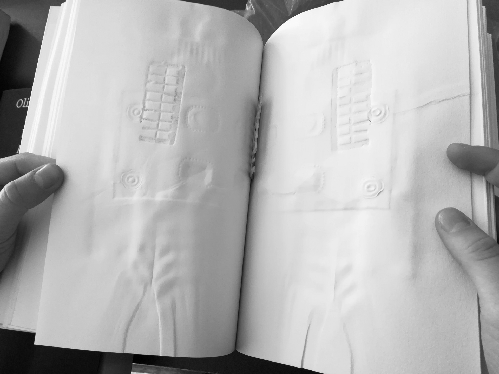
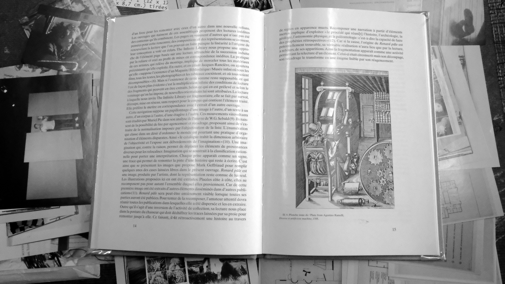

---
title: 
...

&#124; Christian Vandendorpe, Du papyrus à l’hypertexte, Essais sur les mutations du texte et de la lecture, Éditions La Découverte, Paris, 1999 
§ Charles Sanders Peirce, Écrits sur le signe, rassemblés, traduits et commentés par Gérard Deledalle, Éditions du Seuil, Paris, 1992 
† Walter Benjamin, Paris, capitale du XIXe siècle, Éditions Allia, Paris, 2003 
∏ Italo Calvino, Si une nuit d’hiver un voyageur, Éditions Gallimard, Paris, 2002 
◊ Gustave Flaubert, Bouvard et Pécuchet, Le Livre de Poche, Paris, 1999  
∞ Georges Perec, Penser-Classer, Éditions du Seuil, Paris, 2003 
∑ Pierre Bayard, Comment parler des livres que l’on n’a pas lus ? Les Éditions de Minuit, 2007 
¦ Linda Sanchez, 14628.jpg, Éditions Adéra, Lyon, 2012 
∂ Louis Ucciani, Philippe Schepens, Nicole Salzard, L’index fouriériste, Les presses du réel, 2013 
‡ Roland Barthes, Le bruissement de la langue, Essais critiques IV, Éditions du Seuil, Paris, 1984 
Ω François Aubart, Cf., Éditions 2.0.1., Rennes, 2010  
× Jorge Luis Borges, Fictions, Le jardin aux sentiers qui bifurquent, Éditions Gallimard, 1965 
≈ Lev Manovich, Le langage des nouveaux médias, Les presses du réel, Paris, 2010  
∆ Lire à l’écran, Contribution du design aux pratiques et aux apprentissages des savoirs dans la culture numérique, Annick Lantenois, coédition des éditions B42 et de l’École supérieure d’art et design Grenoble-Valence, 2011  
&#92; Gérard Genette, Palimpsestes, La littérature au second degré, Éditions Gallimard, Paris, 1982 
∫ Paul Valéry, La conquête de l’ubiquité, Œuvres tome II, Pièces sur l’art, Éditions Gallimard, 1960

1.

L’index recouvre plusieurs définitions. Il désigne le doigt de la main le plus proche du pouce dont on se sert pour indiquer quelque chose à quelqu’un. Par analogie, l’index fait fonction de repérage matériel en documentologie ou dans le domaine technologique, comme l’aiguille d’un baromètre. L’index se rapporte également à la liste établie par l’Église des livres dont la lecture est interdite aux catholiques en raison des dangers qu’ils peuvent représenter pour la foi ou les mœurs. De même pour l’expression « mettre à l’index » qui signale quelqu’un ou quelque chose comme dangereux pour qu’on s’en détourne. Aussi, l’index est synonyme d’indice. En économie par exemple, il permet de mesurer le sens et l’ampleur de la variation d’un élément. Enfin, la définition de l’index qui m’intéressera le plus se situe dans sa fonction de rappel dans un système. Dans ce cas, il correspond à une liste alphabétique des sujets traités, des noms étudiés ou cités dans un ouvrage, accompagnés de références permettant de les localiser.

2.

 Historiquement, le volumen déroule le texte | tout comme le conteur dévide son histoire. Le lecteur n’a alors d’autres choix que de suivre le flux linéaire du texte. La naissance de la page rompt avec la continuité du rouleau, | elle fera entrer [le texte] dans l’ordre de la tabularité. Dorénavant, la manipulation facilitée du codex permet au lecteur | de n’être plus le récepteur passif du texte, mais de s’introduire à son tour dans le cycle de l’écriture par le jeu des annotations. Grâce au découpage du livre en pages, le texte acquiert une autonomie par rapport à l’oralité et il s’enrichit des tables de matières, de l’index et des titres courants entre le XIe et le XIIIe siècle. À partir de ce moment-là, les imprimeurs multiplient les entrées dans le texte permettant ainsi au lecteur | de moduler sa progression au fil des pages. Il peut désormais oublier ce qu’il a lu plus tôt en le retrouvant dans l’index à la fin du livre.

3.

 À présent au pôle édition, je suis entre une conversation qui ne m’inclut pas mais à laquelle je pourrais être invitée à entrer n’importe quand. La conversation qui m’intéresse de suivre est devant moi à quelques mètres de là. Mais je ne peux pas encore y participer sans l’interrompre. Je ne suis ni réellement dans celle où je me projette ni tout à fait dans celle où je me place. Je suis entre les deux.

4. L'anecdote, quoique marginale, est significative. D’une part, elle met différentes histoires sur un même plan ; elle les réunit sans hiérarchie et il serait compliqué d’en tirer un ordre, des chapitres ou des mots-clés. D’autre part, l’anecdote apparaît justement car elle est révélatrice d’une situation particulière et qu’elle se détache, même un tout petit peu, du cours attendu des choses. 

1.1. Charles Pierce écrit § qu’une girouette est un indice de la direction du vent ; parce que en premier lieu elle prend réellement la même direction que le vent, […] ; et parce que en deuxième lieu […], elle attire notre attention dans cette direction. Le mot déictique “ici” dans un texte pourrait facilement être remplacé par le geste de la main de l’auteur. Ce constat engage la présence effective de l’énonciateur et autorise, par là même, une certaine interaction avec le lecteur. 

3.1. Lorsque je me suis approchée de la porte du bus pour descendre l’autre jour, une femme téléphonait derrière moi. À travers la vitre, je l’ai vu mimer l’agencement des étagères dont elle parlait. Elle indiquait où se trouvait quelque chose. Je me suis dit que son interlocuteur ne se doutait pas des gestes qui appuyaient ses propos.

4.1. La manicule est la schématisation d’une main qui montre utilisée dans l’idée de substituer le geste à la parole ou de l’appuyer. Identifiable dans son dessin, l’index dressé est univoque. Il annonce une information importante à laquelle il faut prêter attention. La manicule indique généralement une chose extérieure à elle telle une béquille qui n’a de valeur que pour ce qu’elle soutient. Elle est d’ailleurs isolée dans la marge en dehors du bloc de texte. 

1.2. Dans le domaine de la linguistique, on note § qu’un indice est un signe qui perdrait immédiatement le caractère qui en fait un signe si son objet était supprimé, mais ne perdrait pas ce caractère s’il n’y avait pas d’interprétant. L’auteur donne l’exemple d’un moulage avec un trou de balle dedans comme signe d’un coup de feu en expliquant qu’il n’y aurait pas eu de trou sans le coup de feu mais qu’il y a néanmoins un trou là, § que quelqu’un ait l’idée de l’attribuer à un coup de feu ou non.

4.2. Au IVe siècle avant J.-C., Hérodote jugeait que le plus important était de se rendre sur place pour commencer à mener son enquête. En 1939, Walter Benjamin identifie la naissance du roman policier dans † le penchant impérieux de l’homme à laisser dans les pièces qu’il habite l’empreinte de son existence individuelle privée. Le lecteur prend alors tous les aspects de l’enquêteur et s’enquiert des vestiges laissés par l’auteur. Il déchiffre et glane des indices pour amasser des clés de compréhension utiles à sa lecture.

2.1. Le livre “Le chant des oubliés” de Fanette&nbsp;Mellier est entouré d’une sur-couverture qui se déplie comme un très long livret piqué par des agrafes. Elle garde en son centre le pli de l’ouvrage auquel elle appartient. Devant soi se trouvent deux objets distincts, signifiants grâce à la présence de l’autre. On pense à un dictionnaire, spécifiquement conçu selon les termes rencontrés dans le livre. 

1.3. Quand j’écris quelque fois, je ne pense pas aux mots que j’écris. Des mots de liaison souvent qui ne sont pas essentiels à l’expression de l’idée mais indispensables pour la construction d’une phrase. La recherche d’information se rapporte à l’indexation des corpus et à l’interrogation ultérieure du fond documentaire constitué. Pour établir un index, l’auteur ou l’éditeur, laisse de côté les mots vides car ils sont tellement communs qu’il est inutile de les indexer. On leur préfère les mots pleins. Leur attribution s’évalue en fonction de leur distribution dans un corpus. Un mot qui apparaît avec une fréquence semblable d’un texte à l’autre de la collection n’est pas discriminant car il ne permet pas de différencier les textes les uns par rapport aux autres. Ainsi, on utilise fréquemment le procédé de lemmatisation qui consiste à repérer les variations d’un même mot en effaçant les terminaisons afin de retrouver sa racine.

2.2. L’index dresse donc une liste résultant d’un dépouillement lexical. Comme Irnerio, le personnage d’Italo Calvino qui apprend à ne pas lire, l’index pourrait se constituer ∏ en regardant les mots intensément jusqu’à ce qu’ils disparaissent et que subsistent les plus signifiants. En appauvrissant le livre jusqu’à une liste succincte de mots, l’index éprouve les qualités évocatrices du langage. L’écriture elliptique de Leslie Kaplan qui use de blancs, de vides, dans “Le Livre des ciels” suffit par exemple à poser un décor pour le lecteur. Une façon de solliciter au maximum son implication. À ce propos, Flaubert disait ◊ qu’on pourrait prendre un sujet, épuiser les sources, en faire bien l'analyse, puis le condenser dans une narration, qui serait comme un raccourci des choses, reflétant la vérité tout entière. 

3.2. Il y a quelques jours, le libraire m’a noté la référence d’un livre à propos de Jean Tortel sur la page de titre arrachée d’un livre écrit par Henry de Montherlant. Je l’ai commandé et j’ai reçu à la place un livre de la même collection d’un auteur différent à propos d’un poète différent. Gérard de Nerval en l’occurrence. Finalement, cette recherche aura réuni des livres dont il n’était pas du tout question au départ.

1.4. Dans les systèmes d’information, certains résultats ne donnent pas satisfaction à la requête de la recherche. Pire, ils peuvent être inappropriés. On parle de “bruit” lorsque des réponses non-pertinentes sont proposées par le système d’interrogation. Et de “silence” lorsque des réponses pertinentes ne sont pas visibles alors qu’elles existent.

1.5. La manière d’indexer limite et influence les possibilités de recherche. Georges Perec a remarqué que la place consacrée aux lettres de l’alphabet dans un dictionnaire n’est pas constante. Les premières lettres de l’alphabet sont plébiscitées et ont la longueur pour s’étendre parfois sur le double de lignes que les lettres de la fin. Ce qui rend obligatoirement les analyses des dernières protagonistes parcellaires et incomplètes.

2.3. Le lecteur circule d’un document à l’autre, se laisse mener par ce qu’il trouve et limite sa recherche au fur et à mesure. Ne viendrait-il pas un moment où l’effet se cristallise à partir de ladite sélection ? Le choix des ouvrages dessinerait alors les contours de la réflexion et non plus l’inverse. Perec s’est d’ailleurs demandé si ∞ l’interrogation déclenchée par ce « Penser-Classer ? » avait mis en question le pensable et le classable d’une façon que [sa] « pensée » ne pouvait réfléchir qu’en s’émiettant, se dispersant, qu’en revenant sans cesse à la fragmentation qu’elle prétendait vouloir mettre en ordre.

4.3. Les mots indexés ont une substance insoupçonnée. Déplacés et isolés, ils renvoient pourtant à un contexte, à une explication, en somme, à un entourage. Avant d’identifier leur contexte d’emploi, les mots deviennent le réceptacle des fantasmes du lecteur. L’index accentue donc ∑ le caractère projectif des mots. Une fois le mot repéré, le lecteur peut ensuite adjoindre aux autres termes de l’index une nouvelle densité contextuelle ; l’expérience du premier sert à situer les autres. L’entourage est une notion clé dans l’emploi des mots. Chacun trouve sa signification dans ¦ ce qui est advenu avant, ce qui suivra après. Indexer est une manière de repérer les individualités en regard de l’ensemble qu’elles constituent. Rapprochés, les mots indexés ne peuvent faire autrement que de creuser l’écart entre eux. Chaque terme est perçu selon l’espace qu’il s’entend occuper avant de toucher la limite du terme suivant.    

2.4. L’index Fouriériste illustre les insistances des termes que le philosophe emploie. Il constitue une amorce de recherche pour aborder son œuvre littéraire, en mettant des termes en regard, tel un “dictionnaire de concepts” comme l’appelle Jacques Guilhaumou. En rendant compte de plusieurs niveaux de profondeur, l’index ne cherche pas à relever uniquement la racine des mots mais répertorie l’ensemble de leurs variations – pluriel, adjectif, verbe. La particularité linguistique de l’œuvre de Charles Fourier réside dans son recours aux néologismes. Ils lui permettaient de se réapproprier le monde en exprimant ∂ ce qui n’est pas encore formulé ou ce qui l’est mal pour toucher du doigt la vérité. ∂ Il s’agit, nous dit-il de faire varier notre point de départ du langage et son but. Entre ces deux points, si néanmoins les mots sont les mêmes, l’emploi du néologisme, laisse poindre leur inévitable remplacement.  

2.5. Christian Vandendorpe rappelle que la fonction première du texte est de pouvoir se passer de la présence de son énonciateur. C’est pourquoi | il doit idéalement viser à créer un contexte de réception qui soit équivalent chez tous les lecteurs. Dans une conversation, l’information se place souvent à la fin, | là où elle sera d’autant mieux décodée qu’elle était plus attendue et mieux contextualisée. De même dans un livre, le lecteur identifiera une nouvelle donnée selon un contexte antérieur : | il est en quelque sorte conduit par sa propre activité de lecture. Il deviendrait alors concevable d’avoir un livre qui s’écourte au fur et à mesure qu’on apprend à connaître le style de l’auteur et l’histoire du narrateur. Néanmoins, ‡ tout récit occidental de type courant, d’après Roland Barthes, possède des indices de caractère ou d’atmosphère pour les détails inutiles qui servent d’informations narratives ; ‡ pris dans un syntagme à la fois référentiel et syntaxique.

3.3. Je suis sur le quai de la gare d’Aix-en-Provence. Le TGV arrive et laisse s’échapper quelques personnes. Une annonce en gare prend le relais : “Nous sommes le 10 février 2019. Il est 18h00. Vous êtes arrivés à Aix-en-Provence TGV” Un passager rigole : « Ça c’est pour les gens qui se sont perdus dans les correspondances pendant deux jours. »

1.6. L’index est un outil qui nous incite à la lecture tout en nous laissant la possibilité de s’en délester. Il traverse le livre en s’appuyant sur des repères numérotés comme des coordonnées géographiques. Il suffirait que l’adresse des mots indexés ne soit plus référencée pour que ceux-ci perdent leur identité et deviennent inexploitables. 

1.7. D’une recherche par mots clés, des extraits de texte s’imbriquent parfois les uns dans les autres. Une formulation comme « selon l’exemple suivant » fournit une réponse incomplète si la suite effective du texte n’est pas retenue dans les résultats de la recherche. De même, lorsqu’un mot, polyvalent de par sa nature, ne se positionne pas de lui-même dans le cadre référentiel de l’interlocuteur, il a recours à des qualificatifs ou des attributs. Dans le contexte de l’hypertexte, | l’auteur ne pouvant pas tenir pour acquis que le lecteur lira ses « pages » dans un ordre donné, il ne peut pas utiliser le futur ni le passé pour fournir des indications d’ordre métanarratif : le récit est condamné à se dérouler dans un éternel présent. […] L’hypertexte est lieu où triomphe par excellence l’idéologie du « ici et maintenant ».

4.4. La consultation simultanée de plusieurs livres nous offre la possibilité de se constituer un environnement de lecture devant soi. À l’image de la roue de livres de Agostino Ramelli qui permet de faire défiler devant son utilisateur un grand nombre d’ouvrages dont il peut tourner les pages en même temps qu’il tourne la roue Ω produisant des combinaisons renouvelées tout en restant dépendant des livres existants. L’inconvénient dans ces systèmes et dans la lecture du fragment en général, c’est que | les automatismes de lecture peuvent devenir moins performants et jouer un moindre rôle, du fait que le contexte de compréhension doit être recréé avec chaque nouveau bloc de texte.

3.4. L’index est comme un deuxième passage de traitement après le premier de structuration de la pensée. Il peut aller jusqu’à acquérir une extériorité autonome. C’est accidentellement ce qui s’est passé avec mon exemplaire du livre Penser-Classer de Georges Perec. À cause des manipulations de lecture, la première partie du livre s’est dissociée de la couverture. Pour passer à la suite, j’ai laissé le bloc de pages à côté. Une fois le paragraphe terminé, l’idée pourrait être de démonter les pages du livre pour les ranger et les classer.

1.8. L’index nous apporte une analyse objective du texte. Il ne relève les mots du texte que d’un point de vue mathématique. Devant cette liste uniforme de mots, il s’avère complexe de décider d’en suivre un en particulier. Il ne fait aucun doute que ceux qui se distinguent de la masse sont les mots qui ont à leur suite une énumération conséquente des pages sur lesquelles ils apparaissent. Néanmoins, sont-ils les plus représentatifs de la pensée de l’auteur ? Une utilisation répétée est-elle le signe d’un tâtonnement de la pensée ou d’une prédominance dans l’argumentation de l’auteur ? À l’inverse, un mot indexé qui n’apparaît pourtant qu’une seule fois dans le texte est-il la manifestation d’une certitude ? Si irréfutable qu’elle n’ait nul besoin d’être expliquée ni réemployée. 

1.9. Peut-on établir l’index d’un index ? Par combien d’étapes faudrait-il passer pour conjuguer un temps de lecture économisé aux propos fidèles de l’auteur ? Un texte se nourrit de sa longueur ; il prend autant de place que ce dont il a besoin. Pourtant, le texte peut se résumer dans les outils qui le concluent : la table des matières et l’index.

2.6. Le livre “Maison des feuilles” de Mark Z. Danielewski comporte un index qui ne rappelle pas fidèlement le texte. Le premier narrateur, à la fois guide au travers du roman et personnage par le biais de notes biographiques et de lettres en annexe, introduit le manuscrit du second narrateur à propos d’un film, qui se révélera fictif, dans lequel se passe une troisième histoire. S’appuyant sur l’appartement du troisième narrateur, cette histoire est une mise en abyme de la forme même du roman : l’intérieur se meut et s’épand alors que l’apparence extérieure reste inchangée. Les différents textes recèlent de contradictions, de renvois qui annulent les dires des pages précédentes, d’autres renvois qui se répondent ou qui amènent à d’autres pages, de notes qui annoncent une page manquante, d’enchevêtrements de plans et d’intrigues pour déboussoler le lecteur et le rendre justement actif de ce qui se joue dans le livre.

4.5. L’index est une entorse à la linéarité de la lecture. Le détour peut être immense à partir du moment où on quitte le livre pour suivre un autre rail sémantique. Indirectement, il ricoche sur des références qui appellent à d’autres références. Dans le cas du livre de Danielewski, il est parfois déceptif car il nous emmène là où la réponse n’est pas. La linéarité est | parfaitement exemplifiée par la succession des heures et des jours, elle relève essentiellement de l’ordre du temps. En imposant un ordre préétabli des paragraphes au lecteur | la linéarité peut certainement être perçue comme une intolérable entrave à la liberté souveraine de l’individu.

1.10. Les termes relevés pour constituer l’index subsistent là où on les prélève. On imaginerait mal un texte vidé de quelques-uns de ses mots, utilisés pour remplir deux pleines pages à la fin de l’ouvrage. Il y a pourtant de ça dans l’invitation à circuler entre le mot dans le texte et son référencement dans l’index. Entre les deux extrémités du livre. L’index se place comme une voie d’accès. C’est justement un lieu intermédiaire dans le laps de temps qu’il nous faut à (re)venir sur la page qui nous intéresse. L’index est cette portion de temps.

4.6. Quand Pierre Bayard pense à ce que peut être la non-lecture d’un livre, il s’aperçoit qu’il faut être en mesure d’établir une distinction entre lire et ne pas lire, ∑ alors que de nombreuses formes de rencontre avec les textes se situent en réalité dans un entre-deux. Le geste de saisie d’un livre masque le geste inverse ∑ celui, involontaire, de non-saisie et de fermeture de tous les livres qui auraient pu, dans une organisation du monde différente, être choisis à la place de l’heureux élu. La recherche numérique implique la formulation d’une requête de la part de l’utilisateur. Nulle place ici au hasard de la découverte d’un livre parmi les rayons d’une bibliothèque physique.

1.11. Les auteurs cités dans le livre “Comment parler des lieux où l’on n’a pas été” opèrent le plus souvent une réécriture psychique de l’endroit où ils disent s’être rendus. Les auteurs qui ne voyagent pas pratiquent une forme d’indexation des œuvres auxquelles ils se rapportent pour écrire leur propre récit. Ils assimilent la subjectivité de l’auteur dont ils s’inspirent pour construire leur ressenti personnel. Mais ce n’est pas un fait assumé. Ils se pourvoient d’un don d’ubiquité pour faire parler les pays qu’ils ne traverseront jamais.   

3.5. C’est bientôt l’heure de la fin du marché. Je m’active et descends de chez moi. À la fin de la rue Sainte-Catherine, je ressens que je n’étais pas prête à être dans la rue. Les pensées qui m’agitaient là-haut m’ont suivies jusqu’ici. Je les laisse aller pour me fondre à l’extérieur.

2.7. × Omettre toujours un mot, avoir recours à des métaphores inadéquates et à des périphrases évidentes, est peut-être la façon la plus démonstrative de l’indiquer. À ce propos, le bibliothécaire de “l'Homme sans qualités” de Musil se garde de n'ouvrir aucun livre pour être certain d'en avoir une vue d'ensemble. Pierre Bayard précise que ∑ l’intérieur du livre est son extérieur, ce qui compte dans chaque livre étant les livres d’à côté. Autrement dit, circuler dans tous les livres et savoir les situer les uns par rapport aux autres, plutôt que s’arrêter en profondeur sur certains pourrait être un gage d'exhaustivité. 

2.8. Le projet “The Infinite Library” de Daniel Gustav Cramer et Haris Epaminonda consiste en le remontage des cahiers d’un livre avec ceux d’un ou de plusieurs autres. Ce système procure un nouveau voisinage aux textes pour suggérer de nouvelles attributions de lecture. Sans prendre à parti le montage du livre, Ryan Gander et Jonathan P. Watts demandent à des artistes de leur envoyer des textes annotés par eux-mêmes dans le projet “The Annotated Reader”. Ce qu’il est intéressant d’y déceler est que même si une page est convoquée par deux personnes différentes, ces dernières n’auront nécessairement pas relevé la même chose.

1.12. Si on tournait une page dans un livre et que les informations de la précédente disparaissaient sous la suivante ; comment pourrait-on fixer quoique ce soit ? Dans le scroll d’une page internet aussi, on garde à l’esprit le contenu que l’on vient de faire défiler et celui qui nous reste à parcourir. Mais il est également impossible de passer à la suivante sans perdre la précédente. L’action de défilement nous invite donc à avancer sans jamais réellement nous fixer sur ce qu’on a devant soi et sans nous décharger de la présence persistante de ce qu’on vient de voir. Avec l’abondance des informations disponibles sur Internet couplée à une sollicitation constante de l’attention, l’hypertexte entraîne une | dynamique de lecture caractérisée par un sentiment d’urgence, de discontinuité et de choix à effectuer constamment.

2.9. Roland Barthes, repris par Lev Manovich, analyse que le rectangle de l’écran ≈ refoule dans le néant tout son entour, innommé, et promeut à l’essence, à la lumière, à la vue, tout ce qu’il fait entrer dans son champ. Cela implique chez l’usager un dédoublement entre l’espace physique de son propre corps et l’espace projectif virtuel de l’écran. En son sein, l’espace informatique ne privilégie aucun axe particulier à la différence de l’espace physique orienté par l’horizon et la verticalité. L’ordinateur permet néanmoins | la prise en compte d’une nouvelle dimension du texte, qui est celle de la profondeur en associant plusieurs couches de textes. C’est grâce à ce paramètre que le projet “Experimenting a 3D Interface for the access to a Digital Library” entend améliorer la navigation dans une bibliothèque numérique. Imaginée dans un cylindre, elle permettrait de combiner plusieurs résultats de recherche en faisant se déplacer l’utilisateur par une rotation axiale et un mouvement vertical. Pour réussir le pari de devenir de véritables outils de travail, les nouvelles technologies ont tout intérêt à profiter de leur valeur ajoutée tout en continuant à s’inspirer de l’espace réel et vécu. 

1.13. Face à l’incommensurable espace que couvre Internet, les concepteurs ont mis en place plusieurs techniques ∆ essentiellement basées sur la visualisation : des lectures en cours d’autres usagers, ou de recommandations inspirées de la navigation passée. Les liens hypertexte quant à eux permettent à un auteur d’inciter son lecteur à lire un autre document en rapport avec son article. Par cet usage anticipé, l’auteur indique qu’il a déjà consulté ce lien sans risquer de sembler copier insidieusement ses sources. L’hypertexte | privilégie le dévoilement par le lecteur des éléments d’information que ce dernier juge nécessaires. Cela situe le concept de l’hypertexte dans une | pragmatique de l’interactivité. Stéphanie Vilayphiou et Alexandre Leray voient dans l’idée d’une publication en ligne l’occasion d’encourager les réactions et les commentaires des lecteurs. Dans leur base de données participatives <stdin> ils ont ∆ découpé le texte en unités sémantiques pour inviter au commentaire de passages précis et obtenir des remarques argumentées. 

4.7. Encerclé par toutes ces nouvelles possibilités numériques, le livre doit en tirer son parti en s’inspirant à son tour de la navigation virtuelle. Dans sa “Tentative d’épuisement d’un lieu parisien”, on peut entrevoir des indices sur le paysage qui entoure Georges Perec par les mots qu’il emploie. Par exemple, la répétition dispersée dans le texte d’un slogan publicitaire nous indique qu’il doit s’agir d’un panneau déroulant qui s’intercale à intervalles réguliers dans ce qu’il s’applique à décrire. Le graphiste Christian Lange dresse la “Lange Liste 79-97” grâce à la tendance méticuleuse de sa mère de conserver les tickets de caisse de supermarché, des vêtements, des loisirs. Plusieurs fois, des photos de famille ou des photos des produits surgissent de la liste et en décalent la suite. Une sorte d’index de consommation journalière d’une famille allemande peu de temps après la réunification dont les achats cadencent le quotidien.

4.8. Gérard Genette explique que la métatextualité &#92; unit un texte à un autre texte dont il parle, sans nécessairement le citer (le convoquer), voire, à la limite, sans le nommer. Le livre “Attraction étrange” de Louise Hervé et Chloé Maillet imbrique des histoires les unes dans les autres : premièrement, on se trouve face à une scène qu’on croit réelle car aucun indice ne contre cette évidence. Deuxièmement, cette scène est transposée à l’intérieur d’une autre scène qui l’englobe et qui de nouveau nous apparaît comme vraie. Troisièmement, un dialogue se crée entre la scène englobante et la scène du début qui s’avère être une reconstitution historique. Quatrièmement, on devine que la scène au présent qui agit sur le diorama influe également sur l’histoire qui se déroule dans le passé. C’est une métaphore de ce que bientôt nous permettront les nouvelles technologies : s’exempter des contraintes de temps et d’espace et recevoir une ∫ réalité sensible à domicile.

3.6. Je me rappelle un soir où j’ai voulu appeler mon père sur le chemin du retour. Je suis tombée sur le répondeur. Quand c’est comme ça, je n’attends jamais assez longtemps pour laisser un message. Considérant que la notification d’un appel en absence suffit à prévenir. Ce jour-là j’ai attendu. J’avais à cœur de laisser un message sympa. Qu’on aurait envie de réécouter. Le portable a vibré à mon oreille, c’était un appel de mon père. Par le biais du répondeur, je lui ai demandé d’attendre car il était en train de m’appeler.  

1.14. Je crois que c’est affaire de contexte. Chacun de nous utilise l’index sans s’interroger car il nous apporte ce qu’on est venu chercher. Il n’y a pas d’attente aucune, il n’y a pas sujet à s’attarder, il ne procure que la fonction dont il est assujetti : informer. Le contexte n’a nullement besoin d’être pensé car il se situe déjà dans le besoin du lecteur. Alors, l’index peut être joué quand il prend conscience de sa propre utilité. Lorsque le prolongement qu’il entend amorcer n’est plus indifférent au contenu auquel il renvoie. 